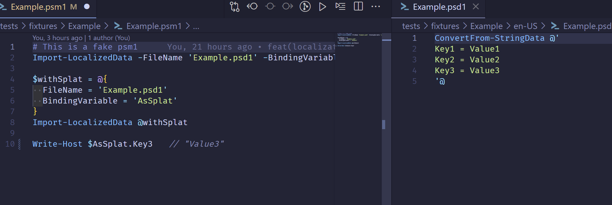

# PowerShell Localization

A Visual Studio Code extension that displays PowerShell localization variable
values as decorations in your editor, making it easier to develop and debug
internationalized PowerShell modules.



## Features

- **Live Decoration Display**: View localization variable values as decorations
  directly in your PowerShell files during code writing (Error Lens style)
- **Real-time Updates**: Values update automatically when localization files  
  change
- **Multi-language Support**: Works with all localization files (en-US, fr-FR,
  etc.)
- **PowerShell Integration**: Seamlessly integrates with PowerShell module
  development workflow
- **Debug Support**: Optional inline values during debugging sessions

## How It Works

The extension automatically scans for PowerShell modules (`.psm1` files) and
their associated localization data files (`.psd1` files in language-specific
folders like `en-US/`, `fr-FR/`, etc.). When you reference localization
variables in your PowerShell code using `$LocalizedData.VariableName`, the
extension will display the actual localized value as a decoration next to your
code.

## Requirements

- Visual Studio Code 1.102.0 or higher
- PowerShell modules with localization data files

## Extension Settings

This extension contributes the following settings:

- `powershellLocalization.enableDecorations`: Enable/disable decoration display
  of localization variable values during code writing (default: true)
- `powershellLocalization.enableInlineValues`: Enable/disable inline display of
  localization variable values during debugging (default: false)
- `powershellLocalization.searchExclude`: Configure glob patterns for excluding
  directories and files from PowerShell module scanning

## Installation

1. Package the extension using the provided scripts
2. Install the `.vsix` file in VS Code
3. Reload VS Code to activate the extension

## Development

To build and install this extension:

```bash
# Using PowerShell script
.\package-and-install.ps1

# Using npm scripts
yarn package-install

# Package only
yarn package-only
```

## Usage

1. Open a PowerShell module (`.psm1` file) that uses localization
2. Ensure you have localization data files in language folders (e.g.,
   `en-US/ModuleName.psd1`)
3. Reference localization variables in your code: `$LocalizedData.MessageText`
4. The extension will display the actual localized values inline

## Contributing

Contributions are welcome! Please feel free to submit issues and pull requests.

## License

MIT
